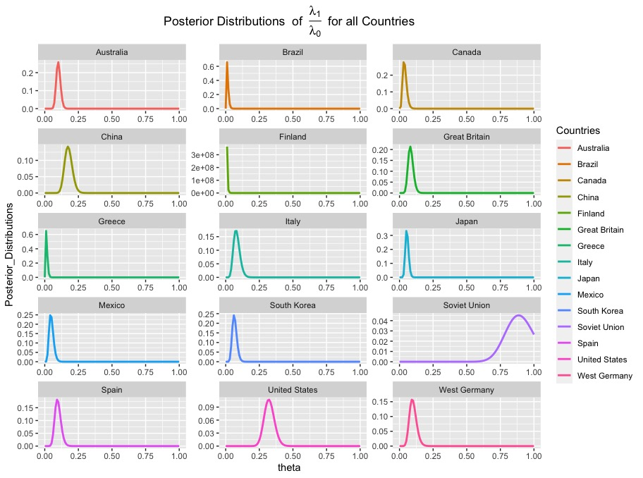

<p align="center">
  
</p>

<h1 align="center">Applied Bayesian Statistics</h1>

<p align="center">
  <strong>A comprehensive collection of assignments and solutions for advanced Bayesian statistical inference</strong>
</p>

<p align="center">
  <a href="#overview">Overview</a> •
  <a href="#topics-covered">Topics</a> •
  <a href="#repository-structure">Structure</a> •
  <a href="#getting-started">Getting Started</a> •
  <a href="#tools--technologies">Tools</a>
</p>

<p align="center">
  
  
  
  
</p>

---

## Overview

This repository contains a **compendium of assignments and their solutions** for an advanced course in **Applied Bayesian Statistics** (ST-540). It provides a comprehensive understanding of theoretical, computational, and practical aspects of Bayesian inference and statistical modeling.

The materials demonstrate real-world applications of Bayesian methods using **R**, **JAGS**, and **Stan**, with extensive visualizations created using **ggplot2**.

---

## Topics Covered

### Theoretical Foundations

| Topic | Description |
|-------|-------------|
| **Bayesian vs Frequentist** | Comparative examination of both statistical paradigms |
| **Bayesian Learning** | Principles of updating beliefs with data |
| **Prior Distributions** | Common choices and their implications |
| **Posterior Summarization** | Techniques for inference from posterior distributions |

### Computational Methods

| Method | Description |
|--------|-------------|
| **Monte Carlo Approximations** | Numerical integration via random sampling |
| **Gibbs Sampling** | Component-wise MCMC algorithm |
| **Metropolis-Hastings** | General-purpose MCMC algorithm |
| **Convergence Diagnostics** | Tools for assessing MCMC chain quality |
| **JAGS Implementation** | Just Another Gibbs Sampler workflows |
| **Hamiltonian Monte Carlo** | Advanced gradient-based sampling |

### Statistical Models

| Model | Application |
|-------|-------------|
| **Multivariate Linear Regression** | Modeling relationships between multiple variables |
| **Generalized Linear Models** | Binary, count, and categorical outcomes |
| **Hierarchical/Multilevel Models** | Handling grouped or nested data structures |
| **Surrogate Models** | Computer experiment emulation |
| **Gaussian Processes** | Flexible nonparametric regression |

---

## Repository Structure

```
Applied-Bayesian-Statistics/
│
├── Assignment 1/             # Intro to Bayesian analysis & data visualization
│   ├── Assignmen1.Rmd        # R Markdown source
│   ├── Assignmen1.pdf        # Compiled solution
│   └── Growth curves data.csv
│
├── Assignment 2/             # Prior distributions & posterior inference
│   ├── Assignment2.Rmd
│   └── Assignment2.pdf
│
├── Assignment 3/             # Monte Carlo methods
│   ├── Assignment_3.Rmd
│   └── Assignment_3.pdf
│
├── Assignment 4/             # Gibbs sampling & MCMC implementation
│   ├── Assignment4.Rmd       # Custom MCMC algorithms
│   └── Assignment4.pdf
│
├── Assignment 5/             # Hierarchical models
│   ├── Assignment5.Rmd
│   └── Assignment5.pdf
│
├── Assignment 6/             # Advanced topics
│   ├── Assignment6.Rmd
│   └── Assignment6.pdf
│
├── Midterm 1/                # Comprehensive examination
│   ├── Midterm.R
│   ├── ST_540_M1.pdf
│   └── Medals.csv
│
├── Midterm 2/                # Advanced topics examination
│   ├── Midterm2.Rmd
│   ├── Midterm2.pdf
│   ├── Metropolis_step_step.R
│   └── EVI_Data.csv
│
├── README.md
└── BP.jpeg                   # Bayesian probability visualization
```

---

## Getting Started

### Prerequisites

Ensure you have **R** (version 4.0 or higher) installed along with the following tools:

#### Required Software

| Tool | Installation |
|------|--------------|
| **JAGS** | [Download from SourceForge](http://sourceforge.net/projects/mcmc-jags/files/) |
| **Stan** | [Installation guide](https://mc-stan.org/users/interfaces/) |

#### R Packages

```r
# Install required packages
install.packages(c(
  "rjags",        # R interface to JAGS
  "ggplot2",      # Data visualization
  "tidyr",        # Data manipulation
  "dplyr",        # Data transformation
  "tibble",       # Modern data frames
  "invgamma",     # Inverse gamma distribution
  "ggforce",      # ggplot2 extensions
  "coda"          # MCMC diagnostics
))
```

### Running the Code

1. **Clone the repository**
   ```bash
   git clone https://github.com/TZhoroev/Applied-Bayesian-Statistics.git
   cd Applied-Bayesian-Statistics
   ```

2. **Open any `.Rmd` file** in RStudio

3. **Knit to PDF** or run code chunks interactively

---

## Tools and Technologies

<table>
  <tr>
    <td align="center" width="120">
      
      <br><strong>R</strong>
      <br><sub>Statistical Computing</sub>
    </td>
    <td align="center" width="120">
      
      <br><strong>ggplot2</strong>
      <br><sub>Visualization</sub>
    </td>
    <td align="center" width="120">
      
      <br><strong>Stan</strong>
      <br><sub>HMC Sampling</sub>
    </td>
    <td align="center" width="120">
      <strong>JAGS</strong>
      <br><sub>Gibbs Sampling</sub>
    </td>
  </tr>
</table>

---

## Key Highlights

### Custom MCMC Implementation

The assignments include **hand-coded MCMC algorithms** demonstrating:
- Gibbs samplers from scratch
- Metropolis-Hastings with tuning
- Convergence diagnostics and visualization
- Comparison with JAGS results

### Real-World Applications

- **NBA Free Throw Analysis** - Hierarchical Beta-Binomial modeling
- **Growth Curve Analysis** - Nonlinear regression with Bayesian inference
- **Olympic Medal Prediction** - Poisson regression models
- **Environmental Vegetation Index** - Spatial-temporal modeling

### Comprehensive Visualizations

Each assignment features extensive visualizations including:
- Posterior density plots
- Trace plots for convergence assessment
- Credible interval comparisons
- Prior vs posterior distributions

---

## Learning Outcomes

After studying these materials, you will be able to:

- Derive full conditional posterior distributions
- Implement Gibbs and Metropolis-Hastings samplers from scratch
- Use JAGS/Stan for complex Bayesian models
- Diagnose MCMC convergence issues
- Apply hierarchical models to real datasets
- Compare and select models using Bayesian criteria

---

## License

This project is for educational purposes. Feel free to use these materials for learning Bayesian statistics.

---

<p align="center">
  <sub>Star this repository if you find it helpful!</sub>
</p>
